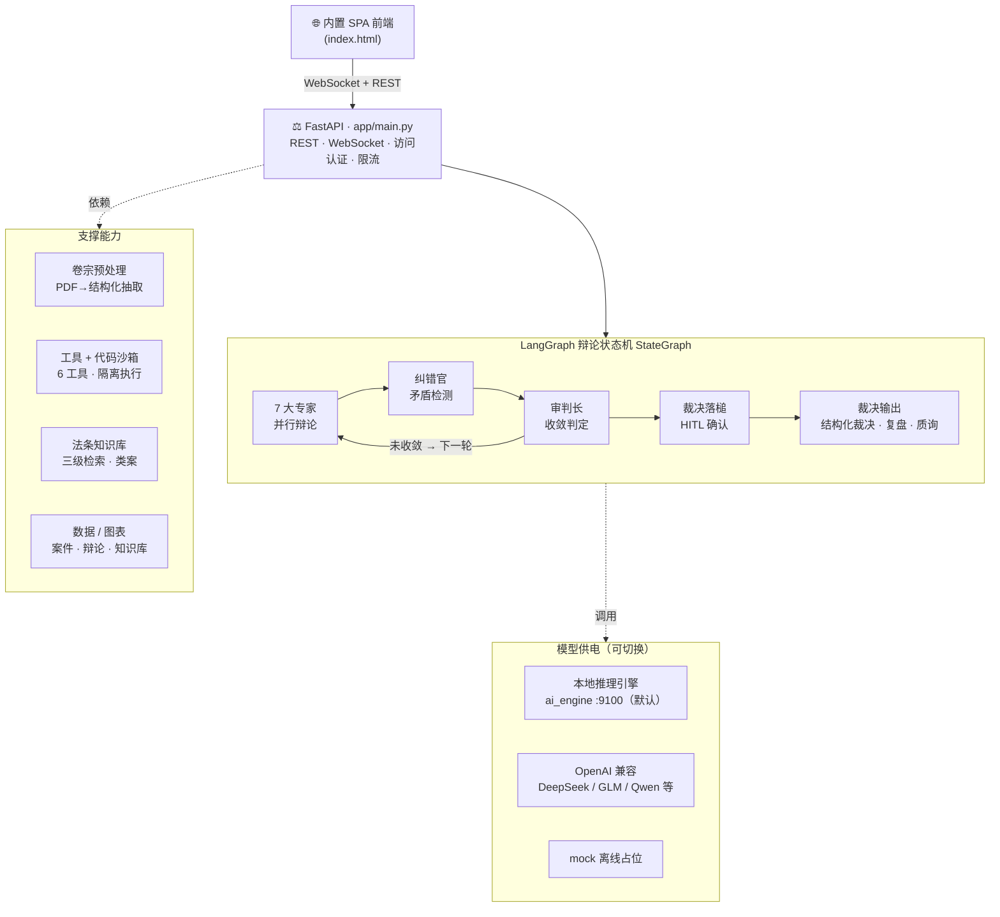
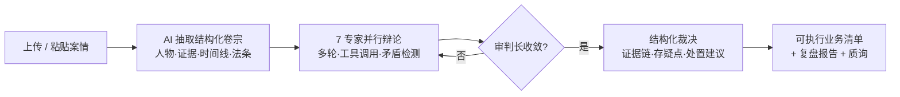

<p align="center">
  
</p>

<h1 align="center">⚖️ VerdictAI · 多智能体法庭辩论与裁决系统</h1>

<p align="center">
  <em>7 个 AI 专家交叉质证真实卷宗，引用真实法条与类案，输出结构化裁决与可执行业务清单</em>
</p>

<p align="center">
  <a href="https://github.com/Morningstar202604/VerdictAI"></a>
  <a href="https://github.com/Morningstar202604/VerdictAI/network/members"></a>
  <a href="https://github.com/Morningstar202604/VerdictAI/issues"></a>
  <a href="https://gitcode.com/badhope/VerdictAI"></a>
  
  
  
  
  
</p>

<p align="center">
  <strong>中文</strong> · <a href="README.ja-JP.md">日本語</a>
</p>

---

## 这是什么

上传一份案件 PDF（侦查报告 / 起诉书 / 判决书），VerdictAI 自动抽取**人物 · 证据 · 时间线 · 适用法条**，
为每个专家生成专属简报，驱动 **7 个 AI 角色多轮对抗式辩论**——他们互相质证、检索法条、调用工具、揪出矛盾，
最后由审判长落槌给出**带证据链与存疑点的结构化裁决**，并附一份可直接派发的**后续动作清单**。整个过程通过 WebSocket 实时流式推送到浏览器。

> 开箱即用：内置**本地确定性推理引擎**（`ai_engine`，端口 9100），无需任何 API Key 即可跑出对真实卷宗的真分析，绝非占位文本。

## 为什么不同

| | 传统 AI 问答 | **VerdictAI** |
|---|---|---|
| 方式 | 单模型、单次作答 | **7 个专职智能体**对抗辩论、互相挑战 |
| 输出 | 一次性文本 | **多轮合议** + 矛盾检测 |
| 透明 | 黑箱 | **全事件流**——每个 token、每次工具调用、每个智能体状态 |
| 引用 | 易幻觉 | **真实法条与类案摘要**——来自内置知识库检索，绝不编造 |
| 文档 | 非结构化上传 | **AI 卷宗理解**——从纯文本 PDF 自动抽取人物 / 证据 / 时间线 / 法条 |
| 裁决 | “AI 说算” | **结构化裁决**——证据链、存疑点、可执行后续清单 |

## 界面一览

| | |
|---|---|
|  |  |
| *案件受理 — PDF 上传、人员名册、AI 结构化抽取* | *实时庭审 — 7 专家辩论、人工插话、使用统计* |
|  |  |
| *裁决书、质询、可派发后续清单* | *深色主题与完整笔录* |

## 核心能力

**7 个专职专家**（每轮并行，立场各异）

| 专家 | 职责 | 立场 |
|------|------|------|
| 🔍 现场勘查员 | 空间逻辑、进出路线、痕迹分布 | 中立 |
| 🔬 法医专家 | 死因、死亡时间窗、伤情 | 科学优先 |
| 🧪 物证分析师 | DNA、指纹、保管链、监控 | 物理证据 |
| 🧠 讯问 / 心理专家 | 供述可信度、动机、画像 | 中立 |
| ⚖️ 证据法专家 | 采信、排除、证明标准 | 程序 |
| 👨‍⚖️ 公诉智能体 | 指控链、漏洞、反驳 | 公诉 |
| 🛡️ 辩护智能体 | 合理怀疑、替代解释 | 辩护 |

**工具增强推理** — 专家不只是说话，还会调用工具（结果直接渲染进笔录）：

`read_evidence`（读证据）· `timeline_check`（时间线校验）· `list_contradictions`（矛盾清单）· `search_case_law`（三级法条检索）· `web_search`（联网检索，可关）· `run_code`（沙箱 Python，matplotlib 图表直接入笔录）

**真实卷宗理解** — PyMuPDF 抽取文本（50 页 / 6 万字符上限），从叙事文本中解析人物 / 证据 / 时间线 / 法条，并把中文时间表达归一化为标准死亡时间窗用于交叉校验；抽取结果带「AI 自动抽取」标记，全部可编辑。

**法条与类案知识库** — 内置《刑诉法》《刑法》《民法典》真实稳定条文 + 间接证据命案等类案摘要；自定义条目经设置页录入，三级检索仅在真正匹配时才引用；检索不到就如实说明，绝不编造。

**多轮辩论引擎** — 可配轮次与记忆窗口，超出窗口的轮次压缩为滚动摘要而非丢弃；AI 纠错官每轮抓矛盾回灌；审判长收敛至共识或轮次上限。

**实时流式与庭审体验** — 逐字输出 + 发言指示；工具调用与图表入笔录；轮次步进、进度条、专家状态；**人工插话**（庭中打断，下轮全员响应）；**裁决后质询**。

**双裁决模式** — AI 审判长自动收敛 / 人工审判长（HITL）暂停复核（超时自动归档）；裁决后输出质询、可勾选**后续清单**（一键复制 / Markdown 导出 / 打印 PDF）；审理终结生成 🔨「审理终结」结案卡（案件 / 轮次 / 用量）与完整复盘报告。

**平台级工程化** — 记忆窗口、上下文上限、并发上限、调用超时、按智能体模型覆盖、策略预设、配置导入导出（设置页 → 智能体工程）。

**部署就绪** — `tools/start_all.py` 一键启停（无窗口守护 + 自动重启）；`ACCESS_PASSWORD` 内网访问口令门（HMAC 会话 + 登录限流）；`run_code` 优先 Docker 沙箱（无网、限内存/CPU）自动降级主机子进程；`tools/backup.py` 数据备份；内置本地引擎可全离线，亦兼容任意 OpenAI 兼容 API；亮 / 暗主题，中 / 英 / 日界面。

## 架构



**关键设计决策**

- **LangGraph StateGraph** — 确定性状态机，而非临时循环
- **asyncio.gather + 并发上限** — 专家并行，友好限流
- **工具容错** — 一次坏调用绝不拖垮整场辩论
- **分层记忆** — 近期轮次全量，久远轮次滚动压缩
- **引用纪律** — 法条 / 类案来自检索，绝不来自模型想象
- **默认引擎** — 出厂即接本地推理引擎（:9100），所见即真实分析

## 一次庭审怎么跑



## 快速开始（约 30 秒）

```bash
# 克隆（GitCode 主仓库）
git clone https://gitcode.com/badhope/VerdictAI.git
# 或 GitHub 镜像
git clone https://github.com/Morningstar202604/VerdictAI.git
cd VerdictAI/backend

# 环境
python -m venv .venv
source .venv/bin/activate          # Windows: .venv\Scripts\activate

pip install -r requirements.txt

# 一键启动：后端 + 本地推理引擎（无窗口守护，自动重启）
python tools/start_all.py
# 停止：python tools/start_all.py stop
```

**生产部署（Docker）**：仓库根目录 `docker compose up -d --build` → 后端在 `:8787` 托管内置 SPA。见 [docs/DEPLOYMENT.md](docs/DEPLOYMENT.md)。

打开 **http://localhost:8787** → 拖入一份 PDF 案件（或粘贴案情描述）→ 看 AI 把它解析成结构化卷宗 → 点 **开庭审理** → 看 7 个 AI 专家实时辩论。

## 模型提供方

开箱即连**内置本地推理引擎**（`backend/ai_engine/`，端口 9100，由 `tools/start_all.py` 拉起）。庭中呈现的是引擎对真实卷宗的确定性分析，无需 API Key。

```env
# backend/.env — 默认值已匹配本地引擎
LLM_PROVIDER=openai_compatible
LLM_BASE_URL=http://127.0.0.1:9100/v1
LLM_MODEL=verdict-local
INTAKE_MODEL=verdict-local-intake
MAX_ROUNDS=3
```

重启服务即可生效。兼容任意 OpenAI 兼容 API（DeepSeek、GLM、Qwen、Step、Ollama 等）——把 `LLM_BASE_URL` 指向你的端点并设置 `LLM_API_KEY`。仅当你明确想要离线占位演示时才设 `LLM_PROVIDER=mock`。

## 文档

| 文档 | 说明 |
|------|------|
| [架构](docs/ARCHITECTURE.md) | 系统设计、状态机、事件类型 |
| [API 参考](docs/API.md) | REST 端点与 WebSocket 协议 |
| [部署](docs/DEPLOYMENT.md) | Docker、systemd、Nginx、性能调优 |
| [贡献指南](CONTRIBUTING.md) | 开发环境与规范 |

## 免责声明

本系统仅用于**研究与演示**。AI 生成的结论属于决策辅助，不构成法律意见；一切最终法律责任由人类法官与法律专业人士承担。

## 许可证

[MIT License](LICENSE) — 可自由用于任何场景。

---

<p align="center"><sub>Built with LangGraph · FastAPI · WebSocket</sub></p>
