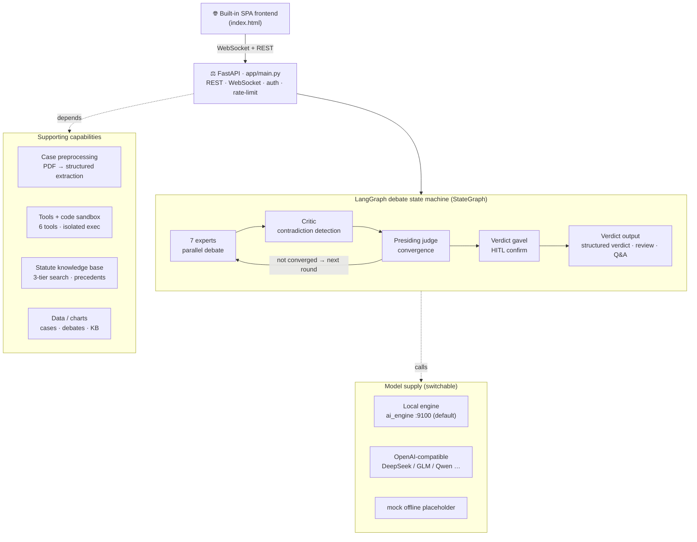
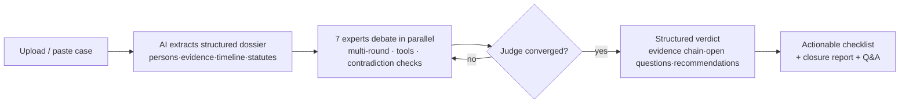

<p align="center">
  
</p>

<h1 align="center">⚖️ VerdictAI · Multi-Agent Courtroom Deliberation</h1>

<p align="center">
  <em>7 AI experts cross-examine real case files, cite real statutes &amp; precedents, and deliver structured verdicts with executable next steps</em>
</p>

<p align="center">
  <a href="https://github.com/Morningstar202604/VerdictAI"></a>
  <a href="https://github.com/Morningstar202604/VerdictAI/network/members"></a>
  <a href="https://github.com/Morningstar202604/VerdictAI/issues"></a>
  <a href="https://gitcode.com/badhope/VerdictAI"></a>
  
  
  
  
  
</p>

<p align="center">
  <strong>English</strong> · <a href="README.zh-CN.md">中文</a> · <a href="README.ja-JP.md">日本語</a>
</p>

---

## What is this

Upload a case PDF (investigation report / indictment / judgment), and VerdictAI auto-extracts **persons · evidence · timeline · applicable statutes**, builds tailored briefs for every expert, and drives a **multi-round adversarial debate among 7 AI roles** — they cross-examine each other, retrieve statutes, call tools, and surface contradictions. The presiding judge then delivers a **structured verdict with an evidence chain and open questions**, plus an **actionable checklist** for judicial staff. The entire trial streams live to your browser over WebSocket.

> Works out of the box: a **bundled local reasoning engine** (`ai_engine`, port 9100) produces real analysis of the actual case file with no API key required — not placeholder text.

## Why it's different

| | Traditional AI Q&A | **VerdictAI** |
|---|---|---|
| Approach | Single model, single answer | **7 specialized agents** debate & challenge each other |
| Output | One-shot text | **Multi-round deliberation** + contradiction detection |
| Transparency | Black box | **Full event stream** — every token, tool call, agent status |
| Citations | Hallucinated | **Real statutes & precedent digests** — retrieved from a built-in knowledge base, never fabricated |
| Documents | Unstructured uploads | **AI document understanding** — persons / evidence / timeline / statutes auto-extracted from plain PDFs |
| Verdict | "AI says so" | **Structured verdict** — evidence chain, open questions, executable next-steps checklist |

## Screenshots

| | |
|---|---|
|  |  |
| *Case intake — PDF upload, roster, AI extraction* | *Live trial — 7 experts, human intervention, usage stats* |
|  |  |
| *Verdict, Q&A, executable next-steps checklist* | *Dark theme, full transcript* |

## Core capabilities

**7 specialized experts** (run in parallel every round, distinct stances)

| Expert | Role | Stance |
|--------|------|--------|
| 🔍 Crime Scene Analyst | Spatial logic, entry/exit, trace distribution | Neutral |
| 🔬 Forensic Specialist | Cause of death, TOD window, injuries | Science first |
| 🧪 Evidence Analyst | DNA, fingerprints, custody chain, surveillance | Physical proof |
| 🧠 Interrogation / Psych Expert | Statement credibility, motive, profiling | Neutral |
| ⚖️ Evidence Law Expert | Admissibility, exclusion, proof standard | Procedure |
| 👨‍⚖️ Prosecutor Agent | Charging chain, gaps, rebuttals | Prosecution |
| 🛡️ Defense Agent | Reasonable doubt, alternative explanations | Defense |

**Tool-augmented reasoning** — experts don't just talk, they call tools (results render into the transcript):

`read_evidence` (read evidence) · `timeline_check` (timeline validation) · `list_contradictions` (flagged issues) · `search_case_law` (three-tier statute search) · `web_search` (live web, toggleable) · `run_code` (sandboxed Python; matplotlib charts render straight into the transcript)

**Real document understanding** — PyMuPDF extracts text (50-page / 60K-char safety limits), parses persons / evidence / timeline / statutes from narrative prose, and normalizes Chinese time expressions into a standard TOD window for cross-validation; extractions carry an "AI auto-extracted" badge and are all editable.

**Statute & precedent knowledge base** — built-in stable provisions from the Criminal Procedure Law, Criminal Law and Civil Code, plus appeal-reasoning digests for indirect-evidence homicide and more; custom entries added via Settings; three-tier search cites them only when they actually match; if nothing matches, agents say so instead of inventing citations.

**Multi-round debate engine** — configurable rounds and memory window; rounds beyond the window are compressed into a rolling digest rather than dropped; an AI critic catches contradictions each round and feeds them back; the judge converges on consensus (or the round cap).

**Real-time streaming & trial UX** — token-by-token expert output with speaking indicators; tool calls and charts in the transcript; round stepper, progress bar, per-expert status; **human intervention** (interject mid-trial, every expert responds next round); **post-verdict Q&A**.

**Dual verdict mode** — AI judge auto-converges / Human judge (HITL) pauses for review (auto-archival on timeout); after the verdict: Q&A follow-ups, an executable **next-steps checklist** with progress tracking, one-click copy / Markdown export / print-to-PDF; a 🔨 "审理终结" closure card (case / rounds / usage) and a full closure report.

**Agent engineering** — memory window, context limit, concurrency cap, call timeout, per-agent model overrides, strategy presets, config import/export (Settings → Agent Engineering).

**Deployment-ready** — `tools/start_all.py` one-command start/stop (windowless daemons, auto-restart); `ACCESS_PASSWORD` intranet gate (HMAC session tokens, login rate-limiting); `run_code` prefers a one-shot Docker sandbox (no network, capped memory/CPU) and degrades to a host subprocess; `tools/backup.py` data backup; runs fully offline with the bundled local engine or against any OpenAI-compatible API; light/dark theme; EN / 中文 / 日本語 UI.

## Architecture



**Key design decisions**

- **LangGraph StateGraph** — deterministic state machine, not ad-hoc loops
- **asyncio.gather + concurrency cap** — experts run in parallel, rate-limit friendly
- **Tool fault tolerance** — one bad tool call never stalls a trial
- **Tiered memory** — recent rounds in full, older rounds rolling-compressed
- **Citation discipline** — statutes / precedents come from retrieval, never model imagination
- **Default engine** — ships connected to the bundled local engine (:9100); what you see is real analysis

## How a trial runs



## Quick start (~30s)

```bash
# Clone (GitCode primary)
git clone https://gitcode.com/badhope/VerdictAI.git
# or GitHub mirror
git clone https://github.com/Morningstar202604/VerdictAI.git
cd VerdictAI/backend

# Environment
python -m venv .venv
source .venv/bin/activate          # Windows: .venv\Scripts\activate

pip install -r requirements.txt

# One command: backend + local reasoning engine (windowless, auto-restart)
python tools/start_all.py
# stop: python tools/start_all.py stop
```

**Production (Docker)**: `docker compose up -d --build` at repo root → backend serves the built-in SPA on `:8787`. See [docs/DEPLOYMENT.md](docs/DEPLOYMENT.md).

Open **http://localhost:8787** → drop in a PDF case (or paste a description) → watch the AI parse it into a structured dossier → click **Open Trial** → watch 7 AI experts argue live.

## Model providers

Out of the box the app connects to the **bundled local reasoning engine** (`backend/ai_engine/`, port 9100, started by `tools/start_all.py`). What you see in the trial is the engine's real deterministic analysis of the actual case file — no API key required.

```env
# backend/.env — defaults already match the local engine
LLM_PROVIDER=openai_compatible
LLM_BASE_URL=http://127.0.0.1:9100/v1
LLM_MODEL=verdict-local
INTAKE_MODEL=verdict-local-intake
MAX_ROUNDS=3
```

Restart the server. Works with any OpenAI-compatible API (DeepSeek, GLM, Qwen, Step, Ollama …) — point `LLM_BASE_URL` at your endpoint and set `LLM_API_KEY`. Set `LLM_PROVIDER=mock` only when you explicitly want an offline placeholder demo.

## Documentation

| Document | Description |
|----------|-------------|
| [Architecture](docs/ARCHITECTURE.md) | System design, state machine, event types |
| [API Reference](docs/API.md) | REST endpoints & WebSocket protocol |
| [Deployment](docs/DEPLOYMENT.md) | Docker, systemd, Nginx, performance tuning |
| [Contributing](CONTRIBUTING.md) | Dev setup & guidelines |

## Disclaimer

This system is for **research and demonstration purposes only**. AI-generated conclusions are decision support, not legal advice; all final legal responsibility rests with human judges and legal professionals.

## License

[MIT License](LICENSE) — use it for anything.

---

<p align="center"><sub>Built with LangGraph · FastAPI · WebSocket</sub></p>
