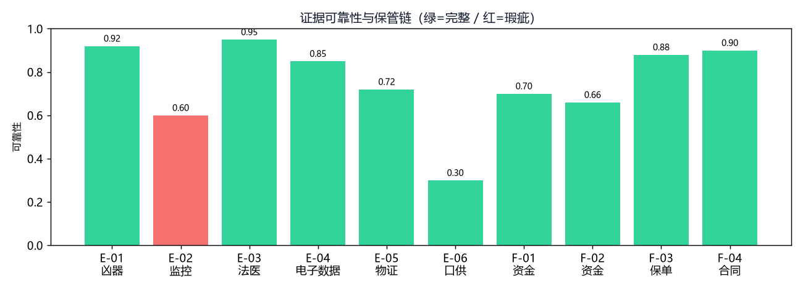

<p align="center">
  
</p>

<h1 align="center">VerdictAI</h1>

<p align="center">
  <strong>Multi-Agent Judicial Debate & Verdict System</strong><br>
  7 domain experts debate through multiple rounds — catch contradictions, surface truth, deliver verdicts.
</p>

<p align="center">
  <a href="#quick-start">Quick Start</a> •
  <a href="#features">Features</a> •
  <a href="#architecture">Architecture</a> •
  <a href="#api-reference">API</a> •
  <a href="#deployment">Deployment</a> •
  <a href="/docs">Docs</a>
</p>

<p align="center">
  
  
  
  
  
</p>

---

## What is VerdictAI?

VerdictAI is a self-hosted, multi-agent AI platform that simulates a **panel of 7 legal experts** debating a criminal case in real-time. Each expert has a distinct role and perspective. They argue, challenge each other, cite evidence, run tools, and converge on a verdict — all streamed live via WebSocket.

Upload a PDF case file → AI extracts facts → 7 experts debate across multiple rounds → a critic catches contradictions → a judge delivers the final verdict.

## Features

| Capability | Description |
|---|---|
| **7 Specialized Agents** | Crime Scene, Forensics, Evidence, Psychology, Evidence Law, Prosecutor, Defense — each with unique prompts and stances |
| **Multi-Round Debate** | Experts debate across configurable rounds (2–5), seeing each other's arguments and adapting |
| **Contradiction Detection** | An AI critic scans each round for contradictions and surfaces them to the next round |
| **Real-Time Streaming** | Every token, tool call, and agent status streamed via WebSocket to the browser |
| **Tool-Augmented Reasoning** | Agents call tools: evidence search, timeline check, contradiction list, statute lookup, annotation |
| **PDF Case Intake** | Upload a PDF → extract text → auto-structure into a case dossier with evidence, timeline, persons |
| **Dual Verdict Modes** | AI judge (auto) or human judge (HITL) — the human can override the AI at any point |
| **Case Library** | Manage multiple cases, replay past debates with full event timelines |
| **Zero-Config Demo** | Ships with mock mode — runs end-to-end with no API key required |
| **Multi-Model Support** | Works with any OpenAI-compatible API: DeepSeek, GLM, Qwen, Step, Ollama, and more |

## Quick Start

### Prerequisites

- Python 3.10+
- (Optional) An OpenAI-compatible API key for real LLM mode

### 1. Install & Run

```bash
git clone https://github.com/Morningstar202604/VerdictAI.git
cd VerdictAI/backend

# Create virtual environment
python -m venv .venv
# Windows:
.venv\Scripts\activate
# Linux/Mac:
source .venv/bin/activate

# Install dependencies
pip install -r requirements.txt

# Start the server
uvicorn app.main:app --host 0.0.0.0 --port 8787
# Or double-click start.bat (Windows)
```

### 2. Open the UI

Navigate to **http://localhost:8787** — that's it. No frontend build step needed.

The single-page app is served directly by FastAPI from `app/static/index.html`.

### 3. Upload a Case & Debate

1. Drag & drop a PDF (or click to select)
2. Watch the 5-step preprocessing animation
3. Click **"开始辩论"** (Start Debate)
4. Observe 7 experts arguing in real-time on the right panel
5. See the critic catch contradictions and the judge deliver a verdict

## Connect a Real LLM

Edit `backend/.env`:

```env
LLM_PROVIDER=openai_compatible
LLM_API_KEY=your-api-key-here
LLM_BASE_URL=https://api.example.com/v1
LLM_MODEL=gpt-4o-mini
INTAKE_MODEL=gpt-4o-mini
MAX_ROUNDS=3
```

Supported providers:
- **OpenAI** (`LLM_PROVIDER=openai`)
- **OpenAI-compatible** (`LLM_PROVIDER=openai_compatible`) — DeepSeek, GLM, Qwen, Step, etc.
- **Ollama** (`LLM_PROVIDER=ollama`) — local models like `qwen2.5:14b`
- **Mock** (`LLM_PROVIDER=mock`) — no API key needed, for testing

Restart the server after changing `.env`.

## Architecture

```
┌─────────────────────────────────────────────────────┐
│                    Frontend (SPA)                     │
│  PDF Upload → Preprocessing → 7-Expert Debate Panel  │
│  Real-time WebSocket streaming + Case Library         │
└──────────────────────┬──────────────────────────────┘
                       │ WebSocket
┌──────────────────────▼──────────────────────────────┐
│                  FastAPI Server                       │
│  POST /api/upload  →  WS /ws/{session}               │
└──────────────────────┬──────────────────────────────┘
                       │
┌──────────────────────▼──────────────────────────────┐
│              LangGraph StateGraph                     │
│                                                       │
│  ┌─────────┐   ┌──────────┐   ┌──────────────┐      │
│  │ Experts  │──▶│  Critic  │──▶│    Judge      │      │
│  │ (7 agent │   │ (detect  │   │ (converge to  │      │
│  │  parallel│   │  contra- │   │  verdict)     │      │
│  │  gather) │   │  dictions│   │               │      │
│  └────┬─────┘   └──────────┘   └──────────────┘      │
│       │         ▲              │                      │
│       └─────────┘  loop N     ▼ done                 │
└──────────────────────────────────────────────────────┘
```

For detailed architecture docs, see [docs/ARCHITECTURE.md](docs/ARCHITECTURE.md).

## API Reference

| Endpoint | Method | Description |
|---|---|---|
| `/api/health` | GET | Server health check |
| `/api/settings` | GET | Current configuration |
| `/api/roles` | GET | List of expert roles |
| `/api/cases` | GET | List stored cases |
| `/api/cases` | POST | Create a new case |
| `/api/cases/{id}` | GET | Get case details |
| `/api/cases` | DELETE | Delete a case |
| `/api/upload` | POST | Upload PDF for preprocessing |
| `/api/debates` | GET | List past debate transcripts |
| `/api/debates/{id}` | GET | Get a specific transcript |
| `WS /ws/{session}` | WS | Real-time debate event stream |

Full API docs: [docs/API.md](docs/API.md)

## Deployment

### Docker (coming soon)

```bash
docker build -t verdictai .
docker run -p 8787:8787 -e LLM_API_KEY=your-key verdictai
```

### Manual

See [docs/DEPLOYMENT.md](docs/DEPLOYMENT.md) for detailed deployment instructions including:
- Environment variables reference
- Reverse proxy configuration (Nginx/Caddy)
- systemd service setup
- Memory and performance tuning

## Project Structure

```
VerdictAI/
├── backend/
│   ├── app/
│   │   ├── main.py              # FastAPI app, routes, PDF extraction
│   │   ├── config.py            # Settings from env vars
│   │   ├── agents/
│   │   │   ├── nodes.py         # LangGraph nodes (experts, critic, judge)
│   │   │   ├── roles.py         # Expert system prompts
│   │   │   ├── tools.py         # Tool definitions for agents
│   │   │   └── agent_config.py  # Agent configuration
│   │   ├── graph/
│   │   │   ├── builder.py       # LangGraph StateGraph definition
│   │   │   └── runner.py        # Debate orchestration logic
│   │   ├── intake/
│   │   │   └── processor.py     # PDF case processing
│   │   ├── models/
│   │   │   ├── llm.py           # LLM provider abstraction
│   │   │   └── state.py         # DebateState TypedDict
│   │   ├── data/
│   │   │   ├── generate_case.py # Demo case generator
│   │   │   └── store.py         # Case storage
│   │   ├── ws/
│   │   │   └── manager.py       # WebSocket connection manager
│   │   └── static/
│   │       ├── index.html       # Single-page frontend
│   │       └── flow.html        # Architecture flow diagram
│   ├── requirements.txt
│   ├── .env.example
│   └── start.bat
├── docs/
│   ├── ARCHITECTURE.md
│   ├── DEPLOYMENT.md
│   └── API.md
├── LICENSE
├── CONTRIBUTING.md
└── README.md
```

## Contributing

See [CONTRIBUTING.md](CONTRIBUTING.md) for development setup and guidelines.

## Disclaimer

This system is for **research and demonstration purposes only**. AI-generated verdicts do not constitute legal advice or judgments. All final legal responsibility rests with human judges and legal professionals.

## License

[MIT](LICENSE)

---

<p align="center">
  <strong>English</strong> | <a href="#readme-中文">中文</a> | <a href="#readme-日本語">日本語</a>
</p>

---

<a id="readme-中文"></a>
## VerdictAI — 中文

**多智能体司法辩论与裁决系统**

上传案卷 PDF → AI 提取事实 → 7 位领域专家多轮辩论 → 纠错官捕获矛盾 → 审判长下达裁决。

### 核心能力

- **7 位专家**：现场勘查 / 法医 / 物证 / 心理 / 证据法 / 检察官 / 辩护人
- **多轮辩论**：可配置 2–5 轮，专家互相审视论点并修正
- **矛盾检测**：AI 纠错官每轮扫描矛盾，推动下一轮深入
- **实时流式**：WebSocket 推送每 token、工具调用、Agent 状态
- **工具增强**：证据检索 / 时间线核对 / 矛盾清单 / 法条查询 / 标注
- **PDF 案件提取**：拖入 PDF → 自动结构化为案件摘要
- **双模式审判**：AI 审判长 / 人类法官（HITL）
- **案例库管理**：多案件存储 + 历史辩论复盘
- **零配置演示**：Mock 模式无需 API Key 即可跑通

### 快速开始

```bash
git clone https://github.com/Morningstar202604/VerdictAI.git
cd VerdictAI/backend
python -m venv .venv && .venv\Scripts\activate
pip install -r requirements.txt
uvicorn app.main:app --host 0.0.0.0 --port 8787
```

打开 `http://localhost:8787` 即可使用。

### 接入真实模型

编辑 `backend/.env`，填入你的 API Key 和 Base URL，重启即可。

### 免责声明

本系统仅用于技术研究与演示。AI 生成的裁决不构成任何法律意见或判决。最终法律责任由人类法官承担。

---

<a id="readme-日本語"></a>
## VerdictAI — 日本語

**マルチエージェント司法ディベート＆判決システム**

事件資料PDFをアップロード → AIが事実を抽出 → 7人の専門家が多ラウンドで議論 → 矛盾を検出 → 裁判長が判決を下す。

### 主な機能

- **7人の専門家**: 現場捜査 / 法医学 / 物証 / 心理学 / 証拠法 / 検察 / 弁護
- **マルチラウンド**: 2〜5ラウンドの設定が可能、専門家が互いの主張を审视して修正
- **矛盾検出**: AI批評官が各ラウンドの矛盾を検出
- **リアルタイム配信**: WebSocketで各トークン、ツール呼び出しをストリーミング
- **ツール拡張**: 証拠検索 / タイムライン確認 / 矛盾一覧 / 法令検索
- **PDF事件処理**: PDFをドロップ → 自動的に事件ダイジェストに構造化
- **デュアル審判**: AI裁判長 / 人間裁判官（HITL）
- **ゼロコンフィグデモ**: MockモードでAPI Keyなしで動作

### クイックスタート

```bash
git clone https://github.com/Morningstar202604/VerdictAI.git
cd VerdictAI/backend
python -m venv .venv && source .venv/bin/activate
pip install -r requirements.txt
uvicorn app.main:app --host 0.0.0.0 --port 8787
```

`http://localhost:8787` にアクセスしてご利用ください。

### 免責事項

本システムは技術研究・デモ用です。AIが生成した判決は法的助言や裁判の効力を持ちません。最終的な法的責任は人間の裁判官にあります。
