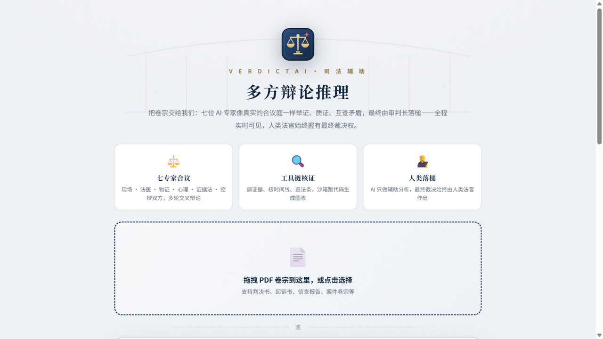
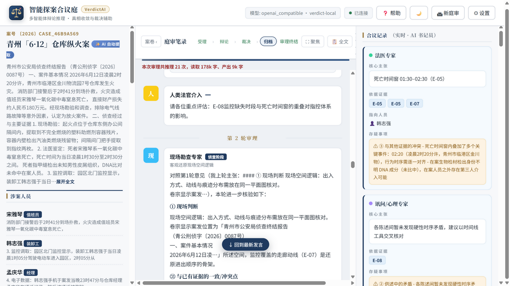
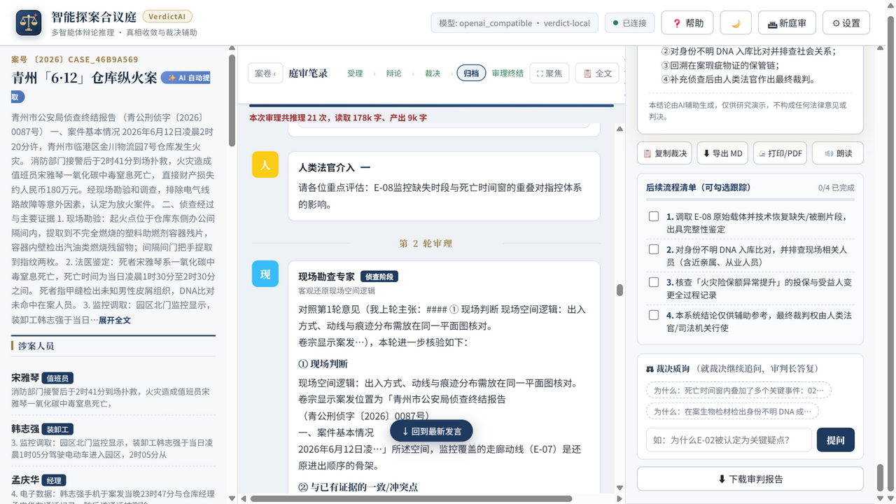
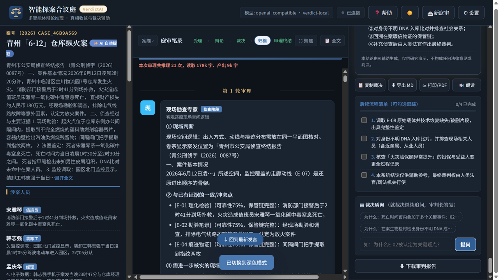

<p align="center">
  
</p>

<h1 align="center">⚖️ VerdictAI · Intelligent Courtroom Deliberation</h1>

<p align="center">
  <em>Multi-Agent Judicial Debate &amp; Verdict System</em>
</p>

<p align="center">
  <a href="https://github.com/Morningstar202604/VerdictAI/stargazers"></a>
  <a href="https://github.com/Morningstar202604/VerdictAI/network/members"></a>
  <a href="https://github.com/Morningstar202604/VerdictAI/issues"></a>
  <a href="https://github.com/Morningstar202604/VerdictAI/actions/workflows/ci.yml"></a>
</p>

<p align="center">
  
  
  
  
  
</p>

<p align="center">
  <strong>English</strong> · <a href="README.zh-CN.md">中文</a> · <a href="README.ja-JP.md">日本語</a>
</p>

---

> **7 AI experts walk into a courtroom.** They examine a real case file, cross-examine each other for multiple rounds, cite statutes, call tools, hunt down contradictions — and the presiding judge delivers a verdict. The entire trial streams live to your browser.

**Bring your own document.** Upload a PDF investigation report, indictment or judgment — VerdictAI reads it, extracts people / evidence / timelines / applicable statutes, assigns tailored briefs to every expert, and runs a full adversarial deliberation that ends in a verdict plus an actionable checklist for judicial staff.

## ✨ What Makes VerdictAI Different?

| | Traditional AI Q&A | **VerdictAI** |
|---|-## 📸 Screenshots

| | |
|---|---|
|  |  |
| *Case intake — PDF upload, roster, AI extraction* | *Live trial — 7 experts, human intervention, usage stats* |
|  |  |
| *Verdict, Q&A, executable next-steps checklist* | *Dark theme, full transcript* |

--|---|
| Approach | Single model, single answer | **7 specialized agents** debate & challenge each other |
| Output | One-shot text | **Multi-round deliberation** + contradiction detection |
| Transparency | Black box | **Full event stream** — every token, tool call, agent status |
| Citations | Hallucinated | **Real statutes & precedent digests** — retrieved from a built-in knowledge base, never fabricated |
| Documents | Unstructured uploads | **AI document understanding** — people / evidence / timeline / statutes auto-extracted from plain PDFs |
| Verdict | "AI says so" | **Structured verdict** with evidence chain, open questions and an executable next-steps checklist |

## 🎯 Features

<details>
<summary><strong>🧠 7 Specialized AI Experts</strong></summary>

Each agent has a unique role, stance and toolset — and they run **in parallel** every round:

| Expert | Role | Stance |
|--------|------|--------|
| 🔍 Crime Scene Analyst | Spatial logic, entry/exit, trace distribution | Neutral |
| 🔬 Forensic Specialist | Cause of death, TOD window, injuries | Science first |
| 🧪 Evidence Analyst | DNA, fingerprints, custody chain, surveillance | Physical proof |
| 🧠 Interrogation/Psych Expert | Statement credibility, motive, profiling | Neutral |
| ⚖️ Evidence Law Expert | Admissibility, exclusion, proof standard | Procedure |
| 👨‍⚖️ Prosecutor Agent | Charging chain, gaps, rebuttals | Prosecution |
| 🛡️ Defense Agent | Reasonable doubt, alternative explanations | Defense |

</details>

<details>
<summary><strong>📄 Real Document Understanding</strong></summary>

Upload a narrative PDF report and the AI intake automatically:

1. Extracts the full text (PyMuPDF, with 50-page / 60K-char safety limits)
2. **Extracts structure from plain prose** — persons (with roles), evidence items, timeline events, applicable statutes, finance/insurance traces
3. Builds tailored briefs for every expert and renders dossier charts
4. Normalizes Chinese time expressions (“凌晨1时30分至2时30分” → a standard TOD window) for cross-validation

The extracted structure is labeled with an **“AI auto-extracted”** badge in the case panel, and everything is editable.

</details>

<details>
<summary><strong>🛠️ Tool-Augmented Reasoning</strong></summary>

Agents don't just talk — they **use tools** (results render inside the transcript):

- `read_evidence` — read a specific evidence item by ID
- `timeline_check` — verify event timing against the case timeline
- `list_contradictions` — review flagged issues
- `search_case_law` — three-tier statute search: case file → custom knowledge base → built-in statute library
- `web_search` — live public web search (Bing CN source, toggleable)
- `run_code` — sandboxed Python (matplotlib charts render right into the transcript)

</details>

<details>
<summary><strong>📚 Knowledge Base & Precedents</strong></summary>

- **Built-in statute library** — real, stable provisions from the Criminal Procedure Law, Criminal Law and Civil Code, plus evidence-review doctrine (three-factor test, chain-of-custody, electronic data)
- **Precedent digests** — appellate reasoning patterns for indirect-evidence homicide, edited surveillance, force-majeure defenses
- **Custom entries** — add your own precedent digests or internal rules via Settings → Knowledge Base; the three-tier search cites them only when they actually match
- **Never fabricate** — if nothing matches, agents say so instead of inventing citations

</details>

<details>
<summary><strong>🔄 Multi-Round Debate Engine</strong></summary>

- Configurable rounds with a **configurable memory window**
- Rounds beyond the window are **compressed into a rolling digest** instead of being dropped
- AI critic catches contradictions each round and feeds them back
- Judge converges on consensus (or round limit)

</details>

<details>
<summary><strong>📹 Real-Time Streaming & Trial UX</strong></summary>

- Live token-by-token expert output with speaking indicators
- Tool calls and sandbox charts rendered in the transcript
- Round stepper, progress bar, per-expert status
- **Human intervention** — interject mid-trial; every expert responds next round
- **Post-verdict Q&A** — keep asking the presiding judge “why”, with suggested follow-up chips

</details>

<details>
<summary><strong>⚖️ Dual Verdict Mode & Post-Verdict Workflow</strong></summary>

- **AI Judge** — automated convergence and verdict delivery
- **Human Judge (HITL)** — pause the trial for human review; auto-archival on configurable timeout
- **After the verdict**: Q&A follow-ups, an executable **next-steps checklist** with progress tracking, one-click copy / Markdown export / print-to-PDF
- Every trial is auto-archived with **usage analytics** (inference count, characters in/out) and full replay

</details>

<details>
<summary><strong>🧩 Agent Engineering (Settings → Agent Engineering)</strong></summary>

Platform-grade runtime controls, inspired by Dify/Coze:

- **Memory window** — how many previous rounds feed each expert
- **Context limit** — max characters per LLM call (protects real cloud models)
- **Concurrency cap** — max parallel experts (rate-limit friendly)
- **Call timeout** — a hung engine never stalls a trial
- **Per-agent model overrides** — cheap model for the clerk, strongest model for the judge
- **Strategy presets** — one-click packaged strategies (“Criminal · strict evidence”, “Civil · liability split”)
- **Agent config import/export** — back up or migrate the whole roster as JSON

</details>

<details>
<summary><strong>🏛️ Deployment-Ready</strong></summary>

- One-command start/stop (`tools/start_all.py`) — windowless daemons with auto-restart
- Access password gate for intranet deployment (`ACCESS_PASSWORD` in `.env`)
- Works fully offline with the bundled local engine, or against any OpenAI-compatible API
- Light/dark theme, English / 中文 / 日本語 UI

</details>

## 🚀 Quick Start (30 seconds)

```bash
# Clone
git clone https://github.com/Morningstar202604/VerdictAI.git
cd VerdictAI/backend

# Setup
python -m venv .venv
.venv\Scripts\activate          # Windows
# source .venv/bin/activate    # Linux/Mac

pip install -r requirements.txt

# One command: backend + local reasoning engine (windowless, auto-restart)
python tools/start_all.py
# stop everything: python tools/start_all.py stop
```

**Open http://localhost:8787** → drop in a PDF case file (or paste a case description) → watch the AI parse it into a structured dossier → click **Open Trial** → watch 7 AI experts argue live.

## 🔌 Connect a Real LLM

```env
# backend/.env
LLM_PROVIDER=openai_compatible
LLM_API_KEY=sk-your-key
LLM_BASE_URL=https://api.deepseek.com/v1
LLM_MODEL=deepseek-chat
MAX_ROUNDS=3
```

Restart the server. Works with any OpenAI-compatible API: DeepSeek, GLM, Qwen, Step, Ollama, and more. No key? A bundled **local engine** (`backend/ai_engine/`) runs the whole pipeline offline.

## 🏗️ Architecture

```
Browser ──WebSocket──▶ FastAPI ──▶ LangGraph StateGraph
                                     │
                        ┌────────────┼────────────┐
                        ▼            ▼             ▼
                   7 Experts     Critic        Judge
                  (parallel)   (per round)   (verdict)
                        │            │             │
                        └────────────┘  loop N     ▼ done
```

**Key Design Decisions:**
- **LangGraph StateGraph** — deterministic state machine, not ad-hoc loops
- **asyncio.gather + concurrency cap** — experts run in parallel, rate-limit friendly
- **Tool fault tolerance** — bad tool calls never crash the debate
- **Tiered memory** — recent rounds in full, older rounds rolling-compressed
- **Citation discipline** — statutes/precedents come from检索 (retrieval), never from model imagination

See [docs/ARCHITECTURE.md](docs/ARCHITECTURE.md) for the full breakdown.

## 📖 Documentation

| Document | Description |
|----------|-------------|
| [Architecture](docs/ARCHITECTURE.md) | System design, state machine, event types |
| [API Reference](docs/API.md) | REST endpoints & WebSocket protocol |
| [Deployment](docs/DEPLOYMENT.md) | Docker, systemd, Nginx, performance tuning |
| [Contributing](CONTRIBUTING.md) | Development setup & guidelines |

## 🤝 Contributing

We welcome contributions! See [CONTRIBUTING.md](CONTRIBUTING.md) for:

- Development setup
- Code style guidelines
- PR process

## ⚠️ Disclaimer

This system is for **research and demonstration purposes only**. AI-generated conclusions are decision support, not legal advice. All final legal responsibility rests with human judges and legal professionals.

## 📜 License

[MIT License](LICENSE) — use it for anything.

---

<p align="center">
  <strong>If you find VerdictAI useful, please consider giving it a ⭐</strong>
</p>

<p align="center">
  <sub>Built with LangGraph • FastAPI • WebSocket</sub>
</p>
